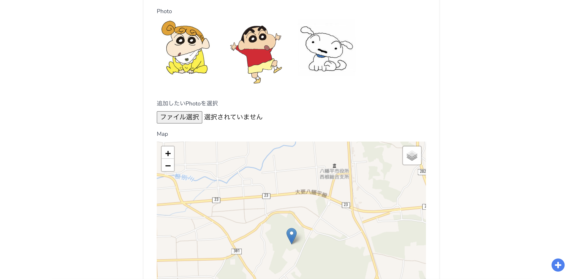

# はちまんたい散歩

## About This App
* はちまんたいの散歩記録
* はちまんたいを散歩していて、なにげない日常を投稿するアプリ
* みんなではちまんたいの散歩をシェアしよう

### Login

### Index

### Create

### Show

### Edit

## Tables
https://docs.google.com/spreadsheets/d/1f5J8Hd2SsxGJa7kjxhAT6l5qh71VtUGwnJxA2-N8GKQ/edit?usp=sharing

## Note
* Laravel Breezeをベースに実装
* Bootstrapは使わず、Tailwindcssのみで実装(複数のCSSフレームワークを混在させたくなかったため)
* GoogleFontを使用して、ロゴを装飾
* 複数ファイルのアップロードに対応、編集画面では一度アップロードしたファイルは変更できないが、ファイルを追加することは可能
* 「新規投稿」は「+」アイコン、全画面で表示したかったので共通部品に組み込み
* Mapを使用
* SNS認証(GitHub、Google、Line、Facebook)を実装
* 画像ファイルはFirebase上に保存
* 投稿した記事(散歩情報)の検索機能を実装
* 一覧画面のサムネイルは、登録してある画像から毎回ランダムに表示
